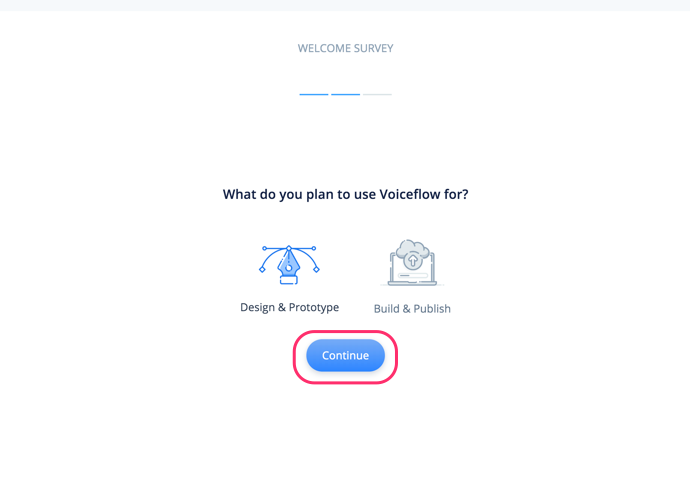

# Voiceflowハンズオン Google Home編 Vol.1

## 概要

### はじめに

Voiceflowを使った、ノンコーディングで始めるGoogle Home向けアクション開発のハンズオン資料です。

### 想定するターゲット

- スマートスピーカーアプリ開発に興味のある方
- Google Homeをお持ちの方
- プログラミングをやったことがない方
- とりあえず始めてみたい方

### 注意

Negative
: 本手順書は2019年9月7日時点のものですが、Voiceflowの開発はかなり活発なので、本手順書通りに進めてもうまくいかない場合や画面が変更されている場合があります。

Negative
: Voiceflowは、一部日本語がうまく扱えないところがあります。そのため、回避策的なやり方で進める場合がありますが、ご了承ください。そのうち改善されるかもしれません。

Negative
: 現時点（2019年9月7日）で、VoiceflowはAlexa向けの機能の方が多いです。Google Homeのサポートはまだまだ発展途中だということを予めご了承ください。

Positive
: 不具合やお気づきの点があれば、kun432.8d1w@gmail.comまで。

### 更新履歴

- 2019/09/07    初版

## 事前準備

### 必要なもの

以下を事前に準備しておいてください。

#### gmailアカウント

以下で使用します。事前に準備しておいてください。

- Voiceflowへのログイン
- Actions on Google / Dialogflow / Google Cloud Platformへのログイン
- Googleスプレッドシートへのログイン

### では始めましょう！

## Voiceflowアカウントの作成とログイン

### Voiceflowアカウントの作成

[https://voiceflow.com/](https://voiceflow.com/)にアクセスします。Voiceflowアカウントを持っていない方は、"Sign up free"をクリックしてアカウントを作成しましょう。
※すでにアカウントを持っている方は、これ以降の作業は不要です。"Sign in"をクリックしてログインし、次の章に進みましょう。

"Sign up with Google" をクリックします。

gmailのログイン画面が出てきたらログインします。

登録後にかんたんなアンケートがありますので、順に答えていきましょう。なお、どれを選択したとしてもVoiceflowの利用に影響はありませんので安心してください。"Continue"をクリックして進めます。

Voiceflowを使う目的（個人利用か、仕事か）を聞いてくるので、適当に選んでください。選んだら、"Continue"をクリックします。

Voiceflowをどういうふうに使うのか（デザインやプロトタイピング、開発やリリース）を聞いてくるので、適当に選んでください。選んだら、"Continue"をクリックします。

プログラミング経験があるか？を聞いてくるので、適当に選んでください。（経験なし、少しだけ経験あり、経験豊富）。選んだら、"Complete"をクリックします。

以下の画面が出てきたらログイン完了です！ちなみに動画の方はVoiceflowのCEOであるBradenさんです。"Get started"をクリックします。

”My First Project" という最初のプロジェクトが開いた状態になっていますが、これは使いません。左上の"＜"をクリックします。

プロジェクトの一覧画面が表示されます。Voiceflowでは、AlexaスキルやGoogle Homeアクションを「プロジェクト」という単位で管理します。右の列にあるのがさっき開いていた、アカウント作成と同時に最初に自動作成される「My First Project」ですね。左の列にはサンプルのプロジェクトが並んでいます。

このハンズオンでは、この一覧画面でプロジェクトの新規作成から行いますので、これらのプロジェクトはすべて使用しません。プロジェクトを作成するとこの画面に一覧表示される、と思ってもらえればよいです。

Positive
: 元々用意されているプロジェクトは、不要であれば削除してもかまいません。特に"My First Project"については、このあとプロジェクトの新規作成を行いますので、削除しても問題ないです。

Positive
: サンプルプロジェクトは、アクションの作り方の参考になると思いますので、興味があれば中身を見てみてください。

Negative
: ただし、これらのサンプルはすべてAlexaスキル向けとなっていますので、そのままではGoogle Home向けには動きません。あくまでも参考と考えていただければと思います。

Negative
: 削除したプロジェクトは復旧できませんので、ご注意ください。

これで準備が整いました。いよいよ次の章からGoogle Home向けのアクションを作っていきます！

---

### おまけ：右下のアイコンは何？

ところで、右下にあるこのアイコン、ずっと表示されていますけど、気になりますね。クリックするとどうなるでしょうか？

下からメニューが表示されました。これがVoiceflowのヘルプツールです。チャットサポートに問い合わせしたり、ドキュメントを検索したり、Voiceflowの稼働状況などを知ることができます。わからないこととかはここから問い合わせり調べればいいというわけですね。ただし英語です・・・

## スキル作成

### プロジェクトの新規作成

