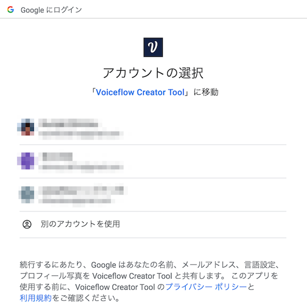
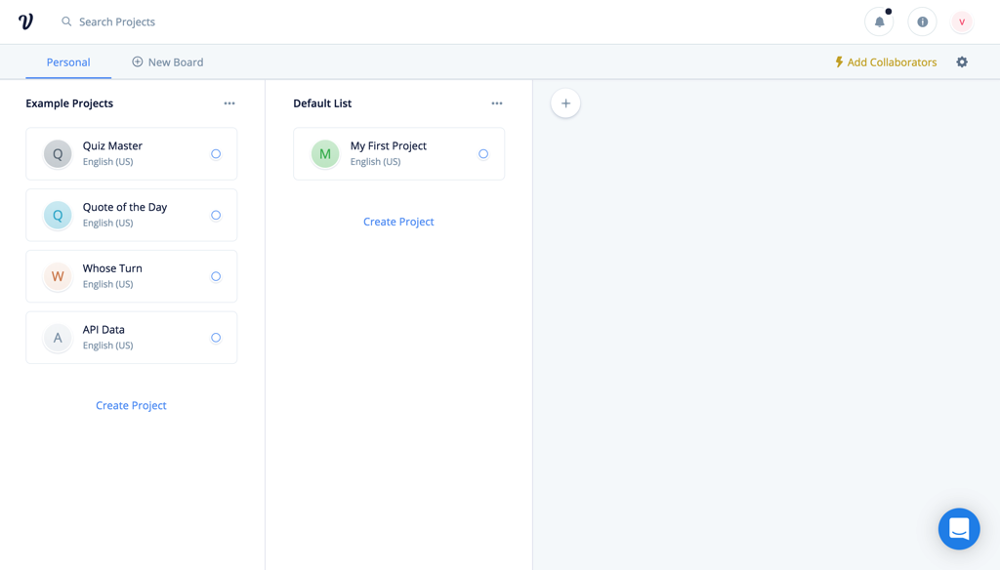

# Voiceflowハンズオン Google Home編 Vol.1

## 概要

### はじめに

Voiceflowを使った、ノンコーディングで始めるGoogle Home向けアクション開発のハンズオン資料です。

### 想定するターゲット

- スマートスピーカーアプリ開発に興味のある方
- Google Homeをお持ちの方
- プログラミングをやったことがない方
- とりあえず始めてみたい方

### 注意

Negative
: 本手順書は2019年9月7日時点のものですが、Voiceflowの開発はかなり活発なので、本手順書通りに進めてもうまくいかない場合や画面が変更されている場合があります。

Negative
: Voiceflowは、一部日本語がうまく扱えないところがあります。そのため、回避策的なやり方で進める場合がありますが、ご了承ください。そのうち改善されるかもしれません。

Negative
: 現時点（2019年9月7日）で、VoiceflowはAlexa向けの機能の方が多いです。Google Homeのサポートはまだまだ発展途中だということを予めご了承ください。

Positive
: 不具合やお気づきの点があれば、kun432.8d1w@gmail.comまで。

### 更新履歴

- 2019/09/07    初版

## 事前準備

### 必要なもの

以下を事前に準備しておいてください。

#### gmailアカウント

以下で使用します。事前に準備しておいてください。

- Voiceflowへのログイン
- Actions on Google / Dialogflow / Google Cloud Platformへのログイン
- Googleスプレッドシートへのログイン

### では始めましょう！

## Voiceflowアカウントの作成とログイン

### Voiceflowアカウントの作成

[https://voiceflow.com/](https://voiceflow.com/)にアクセスします。Voiceflowアカウントを持っていない方は、"Sign up free"をクリックしてアカウントを作成しましょう。
※すでにアカウントを持っている方は、これ以降の作業は不要です。"Sign in"をクリックしてログインし、次の章に進みましょう。

"Sign up with Google" をクリックします。

gmailのログイン画面が出てきたらログインします。

登録後にかんたんなアンケートがありますので、順に答えていきましょう。なお、どれを選択したとしてもVoiceflowの利用に影響はありませんので安心してください。"Continue"をクリックして進めます。

Voiceflowを使う目的（個人利用か、仕事か）を聞いてくるので、適当に選んでください。選んだら、"Continue"をクリックします。

Voiceflowをどういうふうに使うのか（デザインやプロトタイピング、開発やリリース）を聞いてくるので、適当に選んでください。選んだら、"Continue"をクリックします。

プログラミング経験があるか？を聞いてくるので、適当に選んでください。（経験なし、少しだけ経験あり、経験豊富）。選んだら、"Complete"をクリックします。

以下の画面が出てきたらログイン完了です！ちなみに動画の方はVoiceflowのCEOであるBradenさんです。"Get started"をクリックします。

”My First Project" という最初のプロジェクトが開いた状態になっていますが、これは使いません。左上の"＜"をクリックします。

プロジェクトの一覧画面が表示されます。Voiceflowでは、AlexaスキルやGoogle Homeアクションを「プロジェクト」という単位で管理します。右の列にあるのがさっき開いていた、アカウント作成と同時に最初に自動作成される「My First Project」ですね。左の列にはサンプルのプロジェクトが並んでいます。

このハンズオンでは、この一覧画面でプロジェクトの新規作成から行いますので、これらのプロジェクトはすべて使用しません。プロジェクトを作成するとこの画面に一覧表示される、と思ってもらえればよいです。

Positive
: 元々用意されているプロジェクトは、不要であれば削除してもかまいません。特に"My First Project"については、このあとプロジェクトの新規作成を行いますので、削除しても問題ないです。

Positive
: サンプルプロジェクトは、アクションの作り方の参考になると思いますので、興味があれば中身を見てみてください。

Negative
: ただし、これらのサンプルはlexaスキル向けとなっていますので、そのままではGoogle Home向けには動作しない可能性があります。あくまでも参考と考えていただければと思います。

Negative
: 削除したプロジェクトは復旧できませんので、ご注意ください。

これで準備が整いました。いよいよ次の章からGoogle Home向けのアクションを作っていきます！

---

### おまけ：右下のアイコンは何？

ところで、右下にあるこのアイコン、ずっと表示されていますけど、気になりますね。クリックするとどうなるでしょうか？

下からメニューが表示されました。これがVoiceflowのヘルプツールです。チャットサポートに問い合わせしたり、ドキュメントを検索したり、Voiceflowの稼働状況などを知ることができます。わからないこととかはここから問い合わせり調べればいいというわけですね。ただし英語です・・・

## アクションの作成（STEP1）

### 今回作成するサンプルアクションについて

今回のハンズオンでサンプルとして作成するアクションの動作イメージは以下のようなものです。

- ユーザが飲み物を注文します。
- ユーザは１回の注文で、１つの飲み物しか指定できないこととします.
- 注文できる飲み物は、オレンジジュース、ミックスジュース、アップルジュースの３種類とします。
- ユーザの注文内容に応じて、Google Homeからの回答を変えます。
- ユーザの言い方はさまざまなので複数の言い方に対応できるようにします。

シンプルですね！

### プロジェクトの新規作成

では早速プロジェクトを作っていきましょう。"Default List" の下にある"Create Project"をクリックします。

新規プロジェクトの作成画面が開きます。以下を入力します。

| | |
|-----------|------------|
| **項目** | **入力内容** |
| *Enter your project name* | プロジェクト名を入れます。"フルーツパーラー"と入力します。|
| *Select Region* | 言語を選択します。"Japanese(JP)"にチェックを入れて、"English(US)"のチェックを外します。 |

Negative
: Voiceflowでプロジェクトを作成すると、デフォルトはAlexa向けプロジェクトとなり、ここで設定する言語設定はAlexa向けのものとなります。Google Home向けプロジェクトでは別途言語設定が必要になりますので、ご注意ください。

入力したら、"Create Project"をクリックします。

以下の画面が表示されればOKです。

### 画面の構成

最初に画面の構成について説明します。

| | |
|-----------|------------|
| **項目** | **入力内容** |
| *Blocksメニュー* | 機能ごとに分けられたBlockが並んでいます。使いたいBlockをここから選びます。 |
| *Canvas（キャンバス）* | Blocksメニューから選んだBlockをここに配置し、線でつなげていくことで会話フローを作っていきます。|
| *Home Block* | 最初から用意されているのがブロックです。ここから会話フローがスタートし、他のBlockにつなげていきます。なお、Home Blockは削除することはできません。|
| *アップロードボタン* | 作成したプロジェクトをAlexa／Google Homeそれぞれのプラットフォームにアップロードします。アップロードすることでAmazon EchoやGoogle Homeなどのスマートスピーカデバイスから利用可能となります。|
| *Alexa/Google切り替えスイッチ* | 作成したプロジェクトをAlexa向け／Google Home向けに切り替えます。デフォルトはAlexaになっています。|
| *メニュー切り替え* | メニューの切り替えを行います。選択できるメニューには、Blocksメニュー/Flowsメニュー/Variablesメニューがあります。ハンズオンの後半で説明します。|

細かいことは実際に使いながら覚えていきましょう。

### AlexaからGoogleへの切り替え

プロジェクト新規作成直後は、Alexa向けがデフォルトになっています。今回はGoogle Home向けのプロジェクトなので、最初にAlexaからGoogleに切り替えを行います。

中央の一番上にあるAlexa/Google切り替えスイッチをクリックしてください。

スイッチがGoogleにかわり、右のアップロードボタンが "Upload to Alexa" から "Upload to Google" に変わればOKです。

Negative
: 現時点（2019年9月7日）で、VoiceflowはAlexa向けの機能の方が多いです。Google Homeのサポートはまだまだ発展途中だということを予めご了承ください。

Negative
: AlexaとGoogleの切り替えはいつでも行えますが、切り替えるだけで完全に動作するわけではなく、多数修正が必要になるということを予めご了承ください。現実的な対応としては、どちらかのプラットフォーム向けに作り込んだあとで、プロジェクトをコピーして、もう片方向けに修正していく、つまり、それぞれのプラットフォーム向けで別々のプロジェクトとして管理するのが一般的だと思います。

### 言語の設定

プロジェクト新規作成時に設定した言語はAlexa向けのものとなっていますので、Google Home向けにも、別途言語設定を行います。左上のプロジェクト名の少し下にある"Publish"をクリックします。

言語設定画面が開きます。デフォルトでは、"English(En)"が選択されていますので、"Japanese(Ja)"をクリックします。

"Japanese(Ja)"に切り替わりました。これで言語設定は完了です。左上の"Build"をクリックしてCanvas画面に戻ります。

### ブロックの配置

では早速やっていきましょう。最初にGoogle Homeから話をさせてみましょう。Google Homeから話をさせるにはSpeak Blockを使います。左のBlockメニューからSpeak Blockをドラッグ＆ドロップで以下のように配置してください。

右のテキストボックスにGoogle Homeに話させる文章を入力します。ここでは「フルーツパーラーへようこそ。ご注文をどうぞ。」と入力してください。

Home BlockのStartの右端のグレーの四角からドラッグすると線がひけますので、今配置したSpeak Blockの左橋のグレーの四角につなげます。

これで会話フローが繋がりました。このように様々なBlockを並べて、Blockの設定をして、線で順につなげていくことで会話フローを作るのがVoiceflowの基本操作になります。かんたんですね！

### アップロードとGoogle Home向け連携設定（各プロジェクトの初回のみ）

では、早速アップロードして動作するかを確認してみましょう。各プロジェクトの初回アップロード時だけはいろいろ設定の手間がかかるのですが、頑張ってついてきてください！

"Upload to Google"ボタンをクリックします。

Voiceflow から Actions on Google（Googleアシスタントの基本的な管理）へのアクセスに必要な認証トークンを取得します。"Login with Google" をクリックします。

Googleログイン画面が表示されますので、Voiceflowアカウントと同じGoogleアカウントを選択してログインしてください。

アクセス権の許可を求められるので「許可」をクリックします。

認証トークンが画面に表示されます。右端のコピーアイコンをクリックして、クリップボードにコピーします。

Voiceflowの画面に戻って、"Paste code here"に先程の認証トークンをペーストし、"Verify" をクリックします。

認証に成功すると、次に、Actions on GoogleとDialogFlow(Googleアシスタントの会話部分やバックエンド処理を行う部分、Actions on Googleから処理が渡される) との連携を行います。少しややこしいのですが、最初だけなので頑張りましょう！

"here" か "Setup tutorial" をクリックします。

Voiceflowの[Google Home向けセットアップのチュートリアル](https://learn.voiceflow.com/en/articles/2705386-uploading-your-project-to-google-assistant)が開きます。基本的にここに書いてある通りに実施していけばよいのですが、すべて英語で書いてあって辛いと思いますので、ここから日本語で説明していきます！

Actions on Google のURL、[https://developers.google.com/actions/](https://developers.google.com/actions/) にアクセスします。以下のような画面が表示されるはずです。

このとき、右上にログインしているgmailアカウントが表示されます。このアカウントが先程認証トークンを取得する際にログインしたアカウントと同じであることを確認してください。もし違うアカウントになっていれば、切り替えるか、ログインし直してください。

Positive
: 本ハンズオンでは、Voiceflowのログインで使用したgmailアカウントを、Actions on GoogleやDialogFlowでも共通で使うことを想定していますので、ここまですべて同じ一つのgmailアカウントを使用しているはずです。

Negative
: ただし、本ハンズオン用に、普段お使いのgmailアカウントとは別のアカウントをご用意された場合、Actions on GoogleやDialogFlowへのログイン時に、「気づかず」普段のアカウントが選択されている場合がありますのでご注意ください。(その場合、アップロードに失敗する可能性がありますのでご注意ください)

認証トークン取得に使用したgmailアカウントが選択されていることを確認したら、"GO TO ACTIONS CONSOLE"をクリックします。

Actions on Googleの管理画面、「Actions Console」が開きます。まず、Actions Consoleでプロジェクトを作成します。"New Project"をクリックします。

利用規約に同意するかを聞かれます。一番上は、規約に同意するか？なので必ず"Yes"を選択、Country of residence は "Japan" が選択されていることを確認してください。下の2つはお知らせやアンケートの送信に関する許諾なので、どっちでもよいです。同意してすすめるならば"Agree and continue"をクリックします。

新しいプロジェクトの作成画面が開きますので、以下の通り設定します。

| | |
|-----------|------------|
| **項目** | **入力内容** |
| *project name* | プロジェクト名を入れます。アルファベット、数字、一部の記号のみになります。日本語は入力できませんのでご注意ください。今回は"fruits-parlor"と入力します。|
| *Choose a language for ・・・* | 言語を選択します。"Japanese"を選択します。|
| *Choose your country or region* | 国を選択します。"Japan"を選択します。|

設定が終わったら、"Create Project"をクリックします。

次にプロジェクトのテンプレートを選択する画面が表示されます。VoiceflowでDialogFlowを使った会話アクションを作成する場合は、一番右下の"Conversational"をクリックします。

Negative
: Voiceflowでは"Conversational"以外は動作しません。

以下のような画面が表示されればActions on Google上でプロジェクト作成は完了しています。

ここからDialogFlowとの連携設定を行っていきます。"Build your Action"をクリックします。

"Build your Action"のメニューの中の"Add Actions"をクリックします。

"Add your first action"をクリックします。

作成するACTIONを選択する画面が出てきます。"Custom Intent"が選択されていることを確認し、"BUILD"をクリックします。

DialogFlowへのログイン画面が別タブで表示されます。先程まで使用してきたのと同じgmailアカウントを選択してログインします。

アクセス権の許可を求められますので「許可」をクリックします。

DialogFlowの利用規約が表示されます。"Country or territory"に"Japan"が選択されていることを確認したら、"Terms of Service"のチェックボックスにチェックを入れて、"Accept"をクリックします。（Email preferencesの2つのチェックボックスは、お知らせやアンケートに関する許諾なのでどちらでもかまいません。）

Dialogflowの画面が表示されます。

以下の点を「必ず」確認して下さい。

- Actions on Googleで設定したプロジェクト名が「自動」で設定されていること
- GOOGLE PROJECTのところに"Agent will be linked with 〜" という記載で、Actions on Googleで作成したプロジェクト名が表示されていること

上記が正しく設定されていれば、Actions on GoogleとDialogflowの連携が正しく設定されていますので、DEFAULT TIMEZONEが"Asia/Tokyo"となっていることを確認の上、DEFAULT LANGUAGE を "Japanese - ja"を選択して、"CREATE"をクリックします。

Negative
: この2点が設定されていない、または、以下のようなDialogFlowのTOP画面が表示された場合、Actions on GoogleとDialogflowの連携が正しくできていない可能性があります。
【Actions on Googleの設定が正しく連携されていない】

【DialogflowのTOPページが表示される】

この場合は、Dialogflowのタブを閉じて、Actions on Googleのタブに戻り、"Add yoru first action"をクリックしてみてください。（再度ログインやアクセス権の許可が求められるかもしれませんが、そのまま進めれば正しく連携されると思います。）

それでも変わらない場合、Actions on Googleとは異なるgmailアカウントでログインしている可能性も考えられますので、一旦DialogFlowからログアウトしてみてください。

Dialogflowで正しくアクションが作成されると以下のようになります。左上のプロジェクト名の横にある、歯車アイコンをクリックしてください。

設定画面が表示されるので、"Service Account" に記載されているアカウントのリンクをクリックします。ここからはGoogle Cloud Platformでの操作となります。

Google Cloud Platformに初めてログインされる場合は、利用規約への同意を求められますので、利用規約への同意にチェックを入れ、居住国に「日本」が選択されていることを確認の上、「同意して続行」をクリックします。

Negative
: Google Cloud Platformログイン時に「権限がない」というエラーが出る場合があります。その場合は、異なるgmailアカウントで既にGoogle Cloud Platformにログインしている可能性がありますので、これまで使用してきたgmailアカウントに切り替えてください。

Google Cloud Platformの「IAMと管理」という管理画面が表示されたら、真ん中上部にある「＋ サービスアカウントを作成」をクリックします。

「サービスアカウント名」に"Voiceflow Creator Tool"と入力し、「作成」をクリックします。

次に「サービスアカウントの権限」を設定します。「役割を選択」をクリックして・・・

出てきたメニューの一番上で"Dialog"と入力すると表示される「Dialogflow API管理者」を選択します。

"続行"をクリックします。

以下の画面が表示されますので、「キーの作成」をクリックします、

キー作成メニューが表示されるので、キーのタイプは「JSON」を選択して、「作成」をクリックします。

キーファイルがダウンロードされます。これがVoiceflowとの連携に必要です。

Negative
: キーファイルは安全な場所に保管するようにしてください。

サービスアカウント作成画面の一番下の「完了」をクリックします。

Voiceflowに戻り、先程取得したキーファイルをドラッグ＆ドロップでアップロードします。

"Successfully Uploaded" と表示されていればキーファイルが正しくアップロードされています。これでVoiceflowとGoogleの連携は完了です。ほんと、お疲れさまでした！

### テスト

では、いよいよアクションをアップロードして、Google側でテストします。”Upload”をクリックします。

アップロードが行われます。100%になるまで待ちます。

"Action Upload Successful"と表示されれば、アップロードは完了しています！ "Google Action Simulator" をクリックします。

別のタブでGoogleのシミュレータが起動します。初回起動時は以下のような画面が表示されますので、"VERSION - Draft"が選択されていることを確認して、"Done"をクリックします。

これがGoogleのシミュレータです。左が会話をテストするためのシミュレータになっていて、右側は、シミュレータの結果の詳細（スマホのGoogleアシスタントやNest Hubなど画面表示が可能なデバイスの場合の画面表示や、実際に行われているリクエストやレスポンスなど）を表示する場所になっています。

ではテストを行ってみましょう。左のシミュレータの一番下に、会話内容を入力するか、マイクをクリックして実際に発話することでテストが行なえます。

Positive
: なお、Googleの場合、標準では「テスト用アプリ」というアクション名になります。これは後で変更します。

すでにアクションを起動するための発話が入力されているので、そのままENTERを押すか、マイクをクリックして実際にアクションを起動してみてください。

最初にSpeak Blockに設定した文章が音声が流れましたか？画面の方にも同じ内容が表示されていればテストは成功です。

Positive
: Googleの場合、開発中のアクションを実行すると、必ず「〜のテストバージョンです」というセリフが最初に流れるようになっています。アクションを申請・公開するとこのセリフは発話されなくなります。

はい、これでVoiceflowとGoogleの連携設定が完了し、Voiceflowで開発した内容を、Googleにアップロードしてテストできるようになりました。ほんと、お疲れさまでした！

現時点では、VoiceflowのGoogle Home向けサポートは、Alexa向けに比べるとまだまだ発展途中なこともあって、各プロジェクトの初回連携設定に非常に手間がかかるのですが、設定してしまえば以降はアップロードしてテストするだけですし、Googleの高い音声認識精度や、AlexaにはないGoogle独自の面白い機能もあります。ぜひ活用してみてください。

では引き続きアクションを作成していきましょう。

### おまけ：Voiceflowのテスト機能

実は、Google上でテストしなくても、Voiceflowにもテスト機能がありますので、少しご紹介します。

左上にある"Test"をクリックします。

画面が変わりましたね。右上の"Start Test"ボタンをクリックします。

右のメニューでアクションが実行されたのがわかるでしょうか。まだSpeak Blockを一つしかおいてないのでテストがすぐに終わってしまいますが、もっとブロックを並べていくと、ユーザとの会話のやり取りを実際に喋りながら（マイクも使えます）のテストもできますし、変数（後ほどご紹介します）の中身を確認しながらテストを行うデバッグモードなんかもあります。

ただし、以下のような注意点があります。

Negative
: Voiceflowのテストで使用される音声は、実際にGoogle Homeがしゃべる音声とは異なり、またイントネーションなども変わります。実際の印象と比べると、かなり印象が変わります。

Negative
: 実際にGoogle Homeを使う場合とは環境が異なりますので、完全に同じテストができるわけではありません。Voiceflowのテストでは動いたけど、Googleのテストでは動かない、またはその逆、ということもあります。

これらの理由から、Voiceflowのテストはあくまでも簡単な動作確認などにとどめて、正確なテストはActons on Google，もしくは、実機で行うようにしてください。

テストを終わる場合は、左上の"Back"をクリックしてください。Canvas画面に戻ります。

## アクションの作成（STEP2）

### 呼び出し名の設定

アクションの作成を続けていく前に、先程のテスト、呼び出し名が「テスト用アプリ」になっていましたよね？これじゃ気分が出ないので、アクションの呼び出し名を変えましょう。

アクションの呼び出し名は、Voiceflowでは設定できませんので、Actions on Googleで行います。Voiceflowから一度アップロードを行い、Actions on Googleのテスト画面を開いてください。

Positive
: もちろんActions on Googleへ直接アクセスしてもOKです！

テスト画面が開いたら、一番上のメニューの中にある"Develop"をクリックします。

Invocation（呼び出し）の設定画面が開きます。"Japanese"と"English"が並んでいると思いますので、"Japanese"が選択されている状態で、Display Nameの下にあるフォームに呼び出し名を入力します。今回は「フルーツパーラー」と入力します。入力し終わったら、右上の"Save"をクリックして保存します。

Negative
: 呼び出し名は早いもの勝ちです。

Negative
: 呼び出し名はルールがあります。詳しくは、[https://developers.google.com/actions/policies/general-policies#naming_directory_listing_and_promotion](https://developers.google.com/actions/policies/general-policies#naming_directory_listing_and_promotion)をご確認ください。

テストで変わっているか確認してみましょう。一番上のメニューのTestをクリックします。

変わってますね！せっかくなのでマイクを使って試してみましょう。マイクのアイコンをクリックします。

Negative
: ブラウザでマイクの利用を許可する必要があります。

マイクが赤く点滅しているときが待受状態になります。Google Homeの場合は、「〜につないで」でアクションが起動しますので、マイクに向かって「フルーツパーラーにつないで」と言ってみてください。

はい、これで設定した呼び出し名でアクションが起動するようになりました！以降のテストでは新しい呼び出し名で呼び出してテストしてください。

### ユーザの発話を取得する

ではアクションの作成を続けていきましょう。

ここまでで、アクションを起動後、「ご注文をどうぞ」とGoogle Homeが聞いてくるところまではできていますので、次はユーザからの発話を取得するところです。

ユーザからの発話を受け取るためのBlockは複数ありますが、今回は「Interaction Block」を使用します。

Negative
: ユーザからの発話を受け取るためのBlockは、Interaction Blockの他にも、Capture BlockやChoice Blockなどがあります。今回のような複数の選択肢でGoogle Homeからの回答を変えたいような場合は、Choice Blockを使ったほうがシンプルに実現できるのですが、残念ながらChoice Blockには不具合があり、正しく動作しないことがあるため、Interaction Blockを採用しています。（将来的に修正される可能性はあります。）

Positive
: Interaction Blockのほうが判定精度が高く、より柔軟な会話フローの制御ができるため、今後のスキル開発を進めていく上でもChoice Blockよりおすすめです。

BlocksメニューのAdvancedからInteraction Blockを配置しましょう。最初に作ったSpeak Blockの右側に配置して、Speak Blockから線でつなげます。

Interaction Blockをクリックすると、右側にInteraction Blockのメニューが表示されます。"Intents"をクリックします。

ここから設定を行っていくのですがその前に、VUIをやるにあたっていくつか知っておくべき考え方について説明しておきます。

### VUIの基本的なコンセプト

VUIの基本となる重要な考え方として以下の３つがあります。AlexaとGoogleで言い方が違うので少しややこしいかもしれませんが、基本的な考え方は同じなので、そのうち慣れると思います。

1. インテント（Google/Alexa共通）
2. フレーズ（Googleでの言い方）/サンプル発話（Alexaでの言い方）
3. エンティティ（Googleでの言い方）/スロット（Alexaでの言い方）

ぞれぞれ順に説明していきます。

Negative
: **エンティティ/スロットについては、本チャプターでは使用しないため、説明を割愛します。Chapter6で、エンティティを使ってさらにアクションを改善していきますので、その際に説明します。**

Negative
: なお、Vocieflowでは、Alexaの用語がベースになっているようなので、画面などで出てくる用語はAlexaのものになっていることが多いです。予めご了承下さい。

Positive
: 適宜補足していきますので安心してください！

#### インテント

インテント（"Intent"）を辞書でひいて意味を調べると「意図」や「目的」とあります。VUI/スマートスピーカーにおける「意図」「目的」は何なのか？は、VUI/スマートスピーカーの基本的な使い方を考えるとわかりやすいと思います。

1. ユーザがやりたいこと・やってほしいことをスマートスピーカーに話す。
2. ユーザが言ったやりたいこと・やってほしいことを解釈して、それにあった適切な回答をスマートスピーカーが返答する。

この「ユーザがやりたい・やってほしいと思っていること」、これが「インテント」になります。いくつか例を上げると、

- お天気インテント：「お天気を教えて」と言うと、「◯◯県の今日の天気は晴れです」と答えてくれる
- 曲再生インテント：→「○○○の曲をかけて」というと、その曲を再生してくれる

という感じになります。では、今回のサンプルの中でユーザがやりたいことってなんでしょうか？

はい、「オレンジジュースを注文したい」がインテントになりますね。このインテントに対して、注文をうけて金額を回答するというのが今回作成するアクションになります（実際にオレンジジュースを出すのはスマートスピーカーにはできないので人の手が必要ですが・・・）。

このように、ユーザがやりたい「インテント」を用意して、それに応じた処理を作っていく、というのが、VUI／スマートスピーカーアプリ開発の基本的な流れになりますので、まずはこの考え方に慣れるようにしてくださいね。

#### フレーズ/サンプル発話

インテントについては理解できたと思います。が、少し考えてみてください。「オレンジジュースを注文したい」というインテントに対して、あなたが実際にお店に行ったとき、どう話しますか？

- 「オレンジジュースをください」
- 「オレンジジュースください」
- 「オレンジジュースをお願いします」
- 「オレンジジュースお願いします」
- 「オレンジジュースをお願い」
- 「オレンジジュースお願い」
- 「オレンジジュースをちょうだい」
- 「オレンジジュースちょうだい」
- 「オレンジジュースで」
- 「オレンジジュース」

同じ「インテント」なのにいろんな言い方がありますよね。このように、一つの「インテント」に対して、ユーザが実際に発話するバリエーションのことを「フレーズ」「サンプル発話」といいます。

人間の会話の中では些細な違いですが、コンピュータにとっては１文字違うだけで別のデータになります。GoogleやAmazonは、AIやビッグデータを駆使して、こういったバリエーションの違いなども同じインテントとして正しく理解できるように改善を進めていますが、現時点ではまだまだ完璧ではありません。

そこで、開発者側でこれらのバリエーションを「フレーズ」「サンプル発話」として予め「インテント」と紐付けて、ユーザの様々なバリエーションに広く対応できるようにする必要があります。このバリエーションを多数用意すればするほど、ユーザにとっては「精度が高い」ということになりますので、できるだけ多く登録することをおすすめします。

Positive
: GoogleやAmazonでも日々AIの改善は行われていますし、現時点でも細かい違いはある程度よしなに解釈してくれます。

Netagive
: ただし、正しく解釈されるかどうかはやってみないとわからないところもあるので、なるべく多く登録しておくことをおすすめします。

#### エンティティ/スロット

本チャプターで作成するアクションでは、エンティティ/スロットを扱いませんので、説明を割愛します。次のChapterで、エンティティ/スロットを使って、サンプルスキルを更に改修していきますので、その際に説明します。

### インテントの登録

VUIの基本的な考え方がわかったところで、アクションの作成に戻りましょう。Interaction Blockを配置して、"Intents"のタブを開いたところでしたよね。

もうおわかりかと思いますが、ここで「インテント」の設定を行います。初期状態ではインテントが一つもない状態なので、インテントを追加していきましょう。"+ Add Intent"をクリックします。

