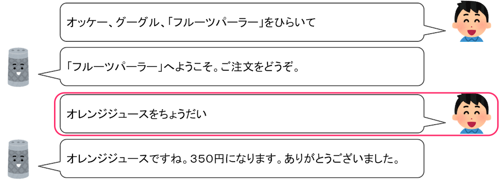
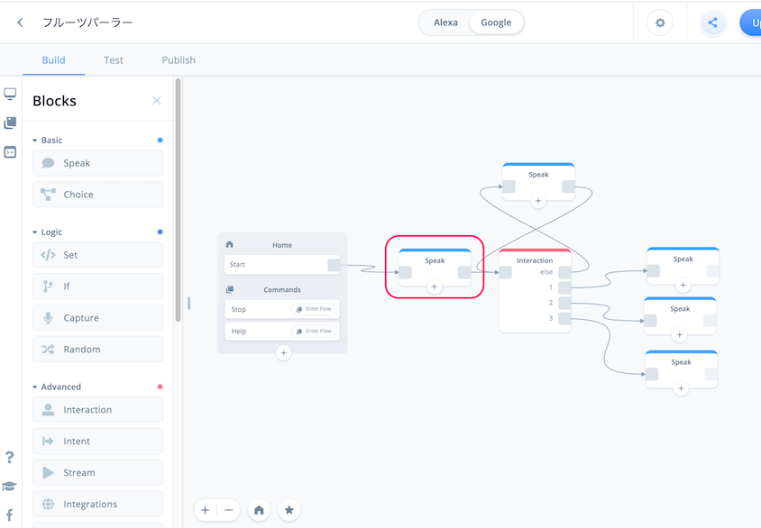
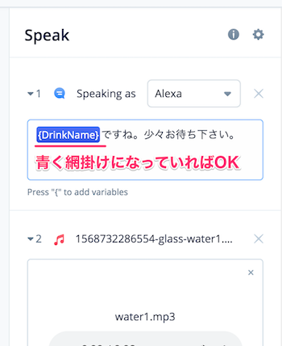
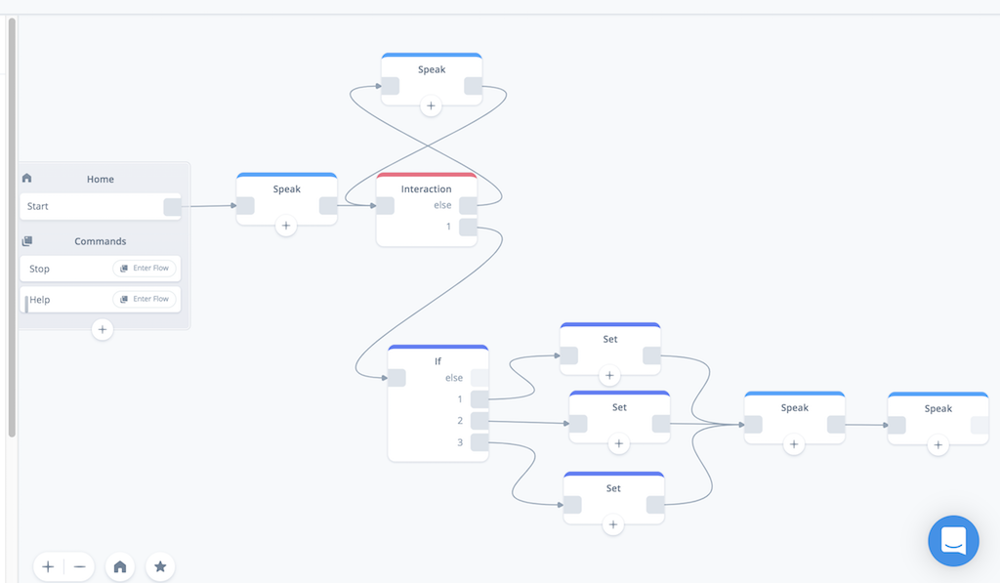
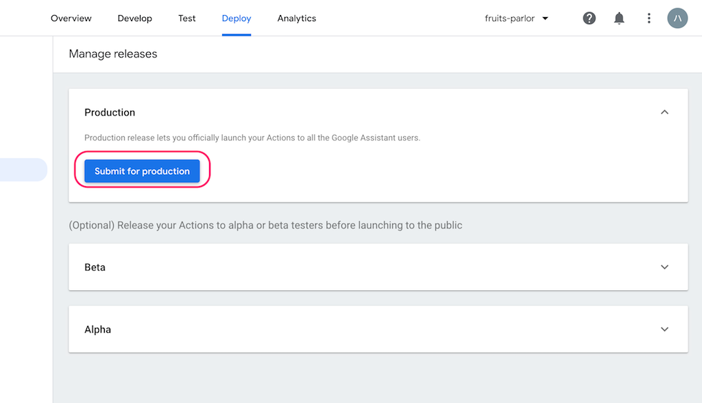

# Voiceflowハンズオン Google Home編 Vol.1

## 概要
Duration: 5:00

### はじめに


Voiceflowを使った、ノンコーディングで始めるGoogle Home向けアクション開発のハンズオン資料です。

### 想定するターゲット

- スマートスピーカーアプリ開発に興味のある方
- Google Homeをお持ちの方
- プログラミングをやったことがない方
- とりあえず始めてみたい方

### 注意

Negative
: 本手順書は2019年10月2日時点のものですが、Voiceflowの開発はかなり活発なので、本手順書通りに進めてもうまくいかない場合や画面が変更されている場合があります。

Negative
: Voiceflowは、一部日本語がうまく扱えないところがあります。そのため、回避策的なやり方で進める場合がありますが、ご了承ください。そのうち改善されるかもしれません。

Negative
: 現時点（2019年10月2日）で、VoiceflowはAlexa向けの機能の方が多いです。Google Homeのサポートはまだまだ発展途中だということを予めご了承ください。

Positive
: 不具合やお気づきの点があれば、[https://github.com/kun432/voiceflow-handson-for-google01/issues](https://github.com/kun432/voiceflow-handson-for-google01/issues)でissue立てていただければと思います。PRも歓迎！

Positive
: もしくはkun432.8d1w@gmail.comまで

### 更新履歴

- 2019/10/02    初版

## 事前準備
Duration: 5:00

### 必要なもの

以下を事前に準備しておいてください。

#### gmailアカウント

以下で使用します。事前に準備しておいてください。

- Voiceflowへのログイン
- Actions on Google / Dialogflow / Google Cloud Platformへのログイン
- Googleスプレッドシートへのログイン

### では始めましょう！
Duration: 10:00

## Voiceflowアカウントの作成とログイン

### Voiceflowアカウントの作成

[https://voiceflow.com/](https://voiceflow.com/)にアクセスします。Voiceflowアカウントを持っていない方は、"Sign up free"をクリックしてアカウントを作成しましょう。
※すでにアカウントを持っている方は、これ以降の作業は不要です。"Sign in"をクリックしてログインし、次の章に進みましょう。


"Sign up with Google" をクリックします。


gmailのログイン画面が出てきたらログインします。


登録後にかんたんなアンケートがありますので、順に答えていきましょう。なお、どれを選択したとしてもVoiceflowの利用に影響はありませんので安心してください。"Continue"をクリックして進めます。


Voiceflowを使う目的（個人利用か、仕事か）を聞いてくるので、適当に選んでください。選んだら、"Continue"をクリックします。


Voiceflowをどういうふうに使うのか（デザインやプロトタイピング、開発やリリース）を聞いてくるので、適当に選んでください。選んだら、"Continue"をクリックします。


プログラミング経験があるか？を聞いてくるので、適当に選んでください。（経験なし、少しだけ経験あり、経験豊富）。選んだら、"Complete"をクリックします。


以下の画面が出てきたらログイン完了です！ちなみに動画の方はVoiceflowのCEOであるBradenさんです。"Get started"をクリックします。


”My First Project" という最初のプロジェクトが開いた状態になっていますが、これは使いません。左上の"＜"をクリックします。


プロジェクトの一覧画面が表示されます。Voiceflowでは、AlexaスキルやGoogle Homeアクションを「プロジェクト」という単位で管理します。右の列にあるのがさっき開いていた、アカウント作成と同時に最初に自動作成される「My First Project」ですね。左の列にはサンプルのプロジェクトが並んでいます。

このハンズオンでは、この一覧画面でプロジェクトの新規作成から行いますので、これらのプロジェクトはすべて使用しません。プロジェクトを作成するとこの画面に一覧表示される、と思ってもらえればよいです。


Positive
: 元々用意されているプロジェクトは、不要であれば削除してもかまいません。特に"My First Project"については、このあとプロジェクトの新規作成を行いますので、削除しても問題ないです。

Positive
: サンプルプロジェクトは、アクションの作り方の参考になると思いますので、興味があれば中身を見てみてください。

Negative
: ただし、これらのサンプルはlexaスキル向けとなっていますので、そのままではGoogle Home向けには動作しない可能性があります。あくまでも参考と考えていただければと思います。

Negative
: 削除したプロジェクトは復旧できませんので、ご注意ください。

これで準備が整いました。いよいよ次の章からGoogle Home向けのアクションを作っていきます！

---

### おまけ：右下のアイコンは何？

ところで、右下にあるこのアイコン、ずっと表示されていますけど、気になりますね。クリックするとどうなるでしょうか？


下からメニューが表示されました。これがVoiceflowのヘルプツールです。チャットサポートに問い合わせしたり、ドキュメントを検索したり、Voiceflowの稼働状況などを知ることができます。わからないこととかはここから問い合わせり調べればいいというわけですね。ただし英語です・・・


## アクションの作成（STEP1）
Duration: 40:00

### 今回作成するサンプルアクションについて

今回のハンズオンでサンプルとして作成するアクションの動作イメージは以下のようなものです。


- ユーザが飲み物を注文します。
- ユーザは１回の注文で、１つの飲み物しか指定できないこととします.
- 注文できる飲み物は、オレンジジュース、ミックスジュース、アップルジュースの３種類とします。
- ユーザの注文内容に応じて、Google Homeからの回答を変えます。
- ユーザの言い方はさまざまなので複数の言い方に対応できるようにします。

シンプルですね！

### プロジェクトの新規作成

では早速プロジェクトを作っていきましょう。"Default List" の下にある"Create Project"をクリックします。


新規プロジェクトの作成画面が開きます。以下を入力します。

| | |
|-----------|------------|
| **項目** | **入力内容** |
| *Enter your project name* | プロジェクト名を入れます。"フルーツパーラー"と入力します。|
| *Select Region* | 言語を選択します。"Japanese(JP)"にチェックを入れて、"English(US)"のチェックを外します。 |

Negative
: Voiceflowでプロジェクトを作成すると、デフォルトはAlexa向けプロジェクトとなり、ここで設定する言語設定はAlexa向けのものとなります。Google Home向けプロジェクトでは別途言語設定が必要になりますので、ご注意ください。

入力したら、"Create Project"をクリックします。


以下の画面が表示されればOKです。


### 画面の構成

最初に画面の構成について説明します。


| | |
|-----------|------------|
| **項目** | **入力内容** |
| *Blocksメニュー* | 機能ごとに分けられたブロックが並んでいます。使いたいブロックをここから選びます。 |
| *Canvas（キャンバス）* | Blocksメニューから選んだブロックをここに配置し、線でつなげていくことで会話フローを作っていきます。|
| *Home Block* | 最初から用意されているのがブロックです。ここから会話フローがスタートし、他のブロックにつなげていきます。なお、Home Blockは削除することはできません。|
| *アップロードボタン* | 作成したプロジェクトをAlexa／Google Homeそれぞれのプラットフォームにアップロードします。アップロードすることでAmazon EchoやGoogle Homeなどのスマートスピーカデバイスから利用可能となります。|
| *Alexa/Google切り替えスイッチ* | 作成したプロジェクトをAlexa向け／Google Home向けに切り替えます。デフォルトはAlexaになっています。|
| *メニュー切り替え* | メニューの切り替えを行います。選択できるメニューには、Blocksメニュー/Flowsメニュー/Variablesメニューがあります。ハンズオンの後半で説明します。|

細かいことは実際に使いながら覚えていきましょう。

### AlexaからGoogleへの切り替え

プロジェクト新規作成直後は、Alexa向けがデフォルトになっています。今回はGoogle Home向けのプロジェクトなので、最初にAlexaからGoogleに切り替えを行います。

中央の一番上にあるAlexa/Google切り替えスイッチをクリックしてください。


スイッチがGoogleにかわり、右のアップロードボタンが "Upload to Alexa" から "Upload to Google" に変わればOKです。


Negative
: 現時点（2019年9月7日）で、VoiceflowはAlexa向けの機能の方が多いです。Google Homeのサポートはまだまだ発展途中だということを予めご了承ください。

Negative
: AlexaとGoogleの切り替えはいつでも行えますが、切り替えるだけで完全に動作するわけではなく、多数修正が必要になるということを予めご了承ください。現実的な対応としては、どちらかのプラットフォーム向けに作り込んだあとで、プロジェクトをコピーして、もう片方向けに修正していく、つまり、それぞれのプラットフォーム向けで別々のプロジェクトとして管理するのが一般的だと思います。

### 言語の設定

プロジェクト新規作成時に設定した言語はAlexa向けのものとなっていますので、Google Home向けにも、別途言語設定を行います。左上のプロジェクト名の少し下にある"Publish"をクリックします。


言語設定画面が開きます。デフォルトでは、"English(En)"が選択されていますので、"Japanese(Ja)"をクリックします。


"Japanese(Ja)"に切り替わりました。これで言語設定は完了です。左上の"Build"をクリックしてCanvas画面に戻ります。


### ブロックの配置

では早速やっていきましょう。最初にGoogle Homeから話をさせてみましょう。Google Homeから話をさせるにはSpeak Blockを使います。左のBlockメニューからSpeak Blockをドラッグ＆ドロップで以下のように配置してください。


右のテキストボックスにGoogle Homeに話させる文章を入力します。以下の文章を入力してください。（コピペしてOKですよ！）

```
フルーツパーラーへようこそ。ご注文をどうぞ。
```


Home BlockのStartの右端のグレーの四角からドラッグすると線がひけますので、今配置したSpeak Blockの左橋のグレーの四角につなげます。


これで会話フローが繋がりました。このように様々なブロックを並べて、設定をして、線で順につなげていくことで会話フローを作るのがVoiceflowの基本操作になります。かんたんですね！

### アップロードとGoogle Home向け連携設定（各プロジェクトの初回のみ）

では、早速アップロードして動作するかを確認してみましょう。各プロジェクトの初回アップロード時だけはいろいろ設定の手間がかかるのですが、頑張ってついてきてください！

"Upload to Google"ボタンをクリックします。


Voiceflow から Actions on Google（Googleアシスタントの基本的な管理）へのアクセスに必要な認証トークンを取得します。"Login with Google" をクリックします。


Googleログイン画面が表示されますので、Voiceflowアカウントと同じGoogleアカウントを選択してログインしてください。


アクセス権の許可を求められるので「許可」をクリックします。


認証トークンが画面に表示されます。右端のコピーアイコンをクリックして、クリップボードにコピーします。


Voiceflowの画面に戻って、"Paste code here"に先程の認証トークンをペーストし、"Verify" をクリックします。


認証に成功すると、次に、Actions on GoogleとDialogFlow(Googleアシスタントの会話部分やバックエンド処理を行う部分、Actions on Googleから処理が渡される) との連携を行います。少しややこしいのですが、最初だけなので頑張りましょう！

"here" か "Setup tutorial" をクリックします。


Voiceflowの[Google Home向けセットアップのチュートリアル](https://learn.voiceflow.com/en/articles/2705386-uploading-your-project-to-google-assistant)が開きます。基本的にここに書いてある通りに実施していけばよいのですが、すべて英語で書いてあって辛いと思いますので、ここから日本語で説明していきます！


Actions on Google のURL、[https://developers.google.com/actions/](https://developers.google.com/actions/) にアクセスします。以下のような画面が表示されるはずです。


このとき、右上にログインしているgmailアカウントが表示されます。このアカウントが先程認証トークンを取得する際にログインしたアカウントと同じであることを確認してください。もし違うアカウントになっていれば、切り替えるか、ログインし直してください。


Positive
: 本ハンズオンでは、Voiceflowのログインで使用したgmailアカウントを、Actions on GoogleやDialogFlowでも共通で使うことを想定していますので、ここまですべて同じ一つのgmailアカウントを使用しているはずです。

Negative
: ただし、本ハンズオン用に、普段お使いのgmailアカウントとは別のアカウントをご用意された場合、Actions on GoogleやDialogFlowへのログイン時に、「気づかず」普段のアカウントが選択されている場合がありますのでご注意ください。(その場合、アップロードに失敗する可能性がありますのでご注意ください)

認証トークン取得に使用したgmailアカウントが選択されていることを確認したら、"GO TO ACTIONS CONSOLE"をクリックします。


Actions on Googleの管理画面、「Actions Console」が開きます。まず、Actions Consoleでプロジェクトを作成します。"New Project"をクリックします。


利用規約に同意するかを聞かれます。一番上は、規約に同意するか？なので必ず"Yes"を選択、Country of residence は "Japan" が選択されていることを確認してください。下の2つはお知らせやアンケートの送信に関する許諾なので、どっちでもよいです。同意してすすめるならば"Agree and continue"をクリックします。


新しいプロジェクトの作成画面が開きますので、以下の通り設定します。

| | |
|-----------|------------|
| **項目** | **入力内容** |
| *project name* | プロジェクト名を入れます。アルファベット、数字、一部の記号のみになります。日本語は入力できませんのでご注意ください。今回は"fruits-parlor"と入力します。|
| *Choose a language for ・・・* | 言語を選択します。"Japanese"を選択します。|
| *Choose your country or region* | 国を選択します。"Japan"を選択します。|

設定が終わったら、"Create Project"をクリックします。


次にプロジェクトのテンプレートを選択する画面が表示されます。VoiceflowでDialogFlowを使った会話アクションを作成する場合は、一番右下の"Conversational"をクリックします。

Negative
: Voiceflowでは"Conversational"以外は動作しません。


以下のような画面が表示されればActions on Google上でプロジェクト作成は完了しています。


ここからDialogFlowとの連携設定を行っていきます。"Build your Action"をクリックします。


"Build your Action"のメニューの中の"Add Actions"をクリックします。


"Add your first action"をクリックします。


作成するACTIONを選択する画面が出てきます。"Custom Intent"が選択されていることを確認し、"BUILD"をクリックします。


DialogFlowへのログイン画面が別タブで表示されます。先程まで使用してきたのと同じgmailアカウントを選択してログインします。


アクセス権の許可を求められますので「許可」をクリックします。


DialogFlowの利用規約が表示されます。"Country or territory"に"Japan"が選択されていることを確認したら、"Terms of Service"のチェックボックスにチェックを入れて、"Accept"をクリックします。（Email preferencesの2つのチェックボックスは、お知らせやアンケートに関する許諾なのでどちらでもかまいません。）


Dialogflowの画面が表示されます。


以下の点を「必ず」確認して下さい。

- Actions on Googleで設定したプロジェクト名が「自動」で設定されていること
- GOOGLE PROJECTのところに"Agent will be linked with 〜" という記載で、Actions on Googleで作成したプロジェクト名が表示されていること

上記が正しく設定されていれば、Actions on GoogleとDialogflowの連携が正しく設定されていますので、DEFAULT TIMEZONEが"Asia/Tokyo"となっていることを確認の上、DEFAULT LANGUAGE を "Japanese - ja"を選択して、"CREATE"をクリックします。

Negative
: この2点が設定されていない、または、以下のようなDialogFlowのTOP画面が表示された場合、Actions on GoogleとDialogflowの連携が正しくできていない可能性があります。
【Actions on Googleの設定が正しく連携されていない】

【DialogflowのTOPページが表示される】

この場合は、Dialogflowのタブを閉じて、Actions on Googleのタブに戻り、"Add yoru first action"をクリックしてみてください。（再度ログインやアクセス権の許可が求められるかもしれませんが、そのまま進めれば正しく連携されると思います。）

それでも変わらない場合、Actions on Googleとは異なるgmailアカウントでログインしている可能性も考えられますので、一旦DialogFlowからログアウトしてみてください。

Dialogflowで正しくアクションが作成されると以下のようになります。左上のプロジェクト名の横にある、歯車アイコンをクリックしてください。


設定画面が表示されるので、"Service Account" に記載されているアカウントのリンクをクリックします。ここからはGoogle Cloud Platformでの操作となります。


Google Cloud Platformに初めてログインされる場合は、利用規約への同意を求められますので、利用規約への同意にチェックを入れ、居住国に「日本」が選択されていることを確認の上、「同意して続行」をクリックします。


Negative
: Google Cloud Platformログイン時に「権限がない」というエラーが出る場合があります。その場合は、異なるgmailアカウントで既にGoogle Cloud Platformにログインしている可能性がありますので、これまで使用してきたgmailアカウントに切り替えてください。

Google Cloud Platformの「IAMと管理」という管理画面が表示されたら、真ん中上部にある「＋ サービスアカウントを作成」をクリックします。


「サービスアカウント名」に"Voiceflow Creator Tool"と入力し、「作成」をクリックします。


次に「サービスアカウントの権限」を設定します。「役割を選択」をクリックして・・・


出てきたメニューの一番上で"Dialog"と入力すると表示される「Dialogflow API管理者」を選択します。


"続行"をクリックします。


以下の画面が表示されますので、「キーの作成」をクリックします、


キー作成メニューが表示されるので、キーのタイプは「JSON」を選択して、「作成」をクリックします。


キーファイルがダウンロードされます。これがVoiceflowとの連携に必要です。

Negative
: キーファイルは安全な場所に保管するようにしてください。


サービスアカウント作成画面の一番下の「完了」をクリックします。


Voiceflowに戻り、先程取得したキーファイルをドラッグ＆ドロップでアップロードします。


"Successfully Uploaded" と表示されていればキーファイルが正しくアップロードされています。これでVoiceflowとGoogleの連携は完了です。ほんと、お疲れさまでした！

### テスト

では、いよいよアクションをアップロードして、Google側でテストします。”Upload”をクリックします。


アップロードが行われます。100%になるまで待ちます。


"Action Upload Successful"と表示されれば、アップロードは完了しています！ "Google Action Simulator" をクリックします。


別のタブでGoogleのシミュレータが起動します。初回起動時は以下のような画面が表示されますので、"VERSION - Draft"が選択されていることを確認して、"Done"をクリックします。


これがGoogleのシミュレータです。左が会話をテストするためのシミュレータになっていて、右側は、シミュレータの結果の詳細（スマホのGoogleアシスタントやNest Hubなど画面表示が可能なデバイスの場合の画面表示や、実際に行われているリクエストやレスポンスなど）を表示する場所になっています。


ではテストを行ってみましょう。左のシミュレータの一番下に、会話内容を入力するか、マイクをクリックして実際に発話することでテストが行なえます。

Positive
: なお、Googleの場合、標準では「テスト用アプリ」というアクション名になります。これは後で変更します。

すでにアクションを起動するための発話が入力されているので、そのままENTERを押すか、マイクをクリックして実際にアクションを起動してみてください。


最初にSpeak Blockに設定した文章が音声が流れましたか？画面の方にも同じ内容が表示されていればテストは成功です。


Positive
: Googleの場合、開発中のアクションを実行すると、必ず「〜のテストバージョンです」というセリフが最初に流れるようになっています。アクションを申請・公開するとこのセリフは発話されなくなります。

はい、これでVoiceflowとGoogleの連携設定が完了し、Voiceflowで開発した内容を、Googleにアップロードしてテストできるようになりました。ほんと、お疲れさまでした！

現時点では、VoiceflowのGoogle Home向けサポートは、Alexa向けに比べるとまだまだ発展途中なこともあって、各プロジェクトの初回連携設定に非常に手間がかかるのですが、設定してしまえば以降はアップロードしてテストするだけですし、Googleの高い音声認識精度や、AlexaにはないGoogle独自の面白い機能もあります。ぜひ活用してみてください。

では引き続きアクションを作成していきましょう。

### おまけ：Voiceflowのテスト機能

実は、Google上でテストしなくても、Voiceflowにもテスト機能がありますので、少しご紹介します。

左上にある"Test"をクリックします。


画面が変わりましたね。右上の"Start Test"ボタンをクリックします。


右のメニューでアクションが実行されたのがわかるでしょうか。まだSpeak Blockを一つしかおいてないのでテストがすぐに終わってしまいますが、もっとブロックを並べていくと、ユーザとの会話のやり取りを実際に喋りながら（マイクも使えます）のテストもできますし、変数（後ほどご紹介します）の中身を確認しながらテストを行うデバッグモードなんかもあります。


ただし、以下のような注意点があります。

Negative
: Voiceflowのテストで使用される音声は、実際にGoogle Homeがしゃべる音声とは異なり、またイントネーションなども変わります。実際の印象と比べると、かなり印象が変わります。

Negative
: 実際にGoogle Homeを使う場合とは環境が異なりますので、完全に同じテストができるわけではありません。Voiceflowのテストでは動いたけど、Googleのテストでは動かない、またはその逆、ということもあります。

これらの理由から、Voiceflowのテストはあくまでも簡単な動作確認などにとどめて、正確なテストはActons on Google，もしくは、実機で行うようにしてください。

テストを終わる場合は、左上の"Back"をクリックしてください。Canvas画面に戻ります。


## アクションの作成（STEP2）
Duration: 40:00

### 呼び出し名の設定

アクションの作成を続けていく前に、先程のテスト、呼び出し名が「テスト用アプリ」になっていましたよね？これじゃ気分が出ないので、アクションの呼び出し名を変えましょう。

アクションの呼び出し名は、Voiceflowでは設定できませんので、Actions on Googleで行います。Voiceflowから一度アップロードを行い、Actions on Googleのテスト画面を開いてください。

Positive
: もちろんActions on Googleへ直接アクセスしてもOKです！


テスト画面が開いたら、一番上のメニューの中にある"Develop"をクリックします。


Invocation（呼び出し）の設定画面が開きます。"Japanese"と"English"が並んでいると思いますので、"Japanese"が選択されている状態で、Display Nameの下にあるフォームに呼び出し名を入力します。今回は「フルーツパーラー」と入力します。入力し終わったら、右上の"Save"をクリックして保存します。

Negative
: 呼び出し名は早いもの勝ちです。

Negative
: 呼び出し名はルールがあります。詳しくは、[https://developers.google.com/actions/policies/general-policies#naming_directory_listing_and_promotion](https://developers.google.com/actions/policies/general-policies#naming_directory_listing_and_promotion)をご確認ください。


テストで変わっているか確認してみましょう。一番上のメニューのTestをクリックします。


変わってますね！せっかくなのでマイクを使って試してみましょう。マイクのアイコンをクリックします。

Negative
: ブラウザでマイクの利用を許可する必要があります。


マイクが赤く点滅しているときが待受状態になります。Google Homeの場合は、「〜につないで」でアクションが起動しますので、マイクに向かって「フルーツパーラーにつないで」と言ってみてください。


設定した呼び出し名でアクションが起動してますね！


これで呼び出し名の変更は完了です。以降のテストでは新しい呼び出し名で呼び出してテストしてください。

### 言語設定の変更

ついでにもう一つ、Actions on Googleの呼び出し名の設定画面を開いてください。（Actions on Googleの上のメニューの"Develop"をクリックしてください）


呼び出し名の上の"Japanese"の横に"English"も表示されていますね？


Actions on Googleでは、１つのアクションで複数の言語に対応しておくと、Google Homeの言語設定に応じてそれぞれの言語で動作するようになっています。ただし、その場合はVoiceflow側でもそれにあわせて作り込む必要がありますし、今回のハンズオンでは対応しません。このまま放置しておいても問題なさそうなのですが、もしアクションを申請・公開される場合、ここの設定も審査される可能性がありますので、対応しないのであれば消しておいたほうがよいでしょう。

対応している言語を設定するには、右端の"Modify languages"をクリックします。


対応している言語の一覧が表示されます。"Japanese"以外のチェックが入っていればチェックを外してください。


右上の"Save"をクリックして保存します。


警告画面が表示されます。削除する言語が正しいことを確認して"OK"をクリックします。


はい、これで不要な対応言語の作成が完了しました。

### ユーザの発話を取得する

ではアクションの作成を続けていきましょう。

ここまでで、アクションを起動後、「ご注文をどうぞ」とGoogle Homeが聞いてくるところまではできていますので、次はユーザからの発話を取得するところです。



ユーザからの発話を受け取るためのブロックは複数ありますが、今回は「Interaction Block」を使用します。

Negative
: ユーザからの発話を受け取るためのブロックは、Interaction Blockの他にも、Capture BlockやChoice Blockなどがあります。今回のような複数の選択肢でGoogle Homeからの回答を変えたいような場合は、Choice Blockを使ったほうがシンプルに実現できるのですが、残念ながらChoice Blockには不具合があり、正しく動作しないことがあるため、Interaction Blockを採用しています。（将来的に修正される可能性はあります。）

Positive
: Interaction Blockのほうが判定精度が高く、より柔軟な会話フローの制御ができるため、今後のスキル開発を進めていく上でもChoice Blockよりおすすめです。

BlocksメニューのAdvancedからInteraction Blockを配置しましょう。最初に作ったSpeak Blockの右側に配置して、Speak Blockから線でつなげます。


Interaction Blockをクリックすると、右側にInteraction Blockのメニューが表示されます。"Intents"をクリックします。


ここから設定を行っていくのですがその前に、VUIをやるにあたっていくつか知っておくべき考え方について説明しておきます。

### VUIの基本的なコンセプト

VUIの基本となる重要な考え方として以下の３つがあります。AlexaとGoogleで言い方が違うので少しややこしいかもしれませんが、基本的な考え方は同じなので、そのうち慣れると思います。

1. インテント（Alexa/Google共通）
2. サンプル発話（Alexaでの言い方）/フレーズ（Googleでの言い方）
3. スロット（Alexaでの言い方）/エンティティ（Googleでの言い方）

ぞれぞれ順に説明していきます。

Negative
: **スロット/エンティティについては、本チャプターでは使用しないため、説明を割愛します。Chapter7で、スロットを使ってさらにアクションを改善していきますので、その際に説明します。**

Negative
: なお、Vocieflowでは、Alexaの用語がベースになっているようで、画面などで出てくる用語はAlexaのものになっていることが多いです。本資料でも、以降はAlexaの言い方で統一したいと思います。予めご了承下さい。

Positive
: 適宜補足していきますので安心してください！

#### インテント

インテント（"Intent"）を辞書でひいて意味を調べると「意図」や「目的」とあります。VUI/スマートスピーカーにおける「意図」「目的」は何なのか？は、VUI/スマートスピーカーの基本的な使い方を考えるとわかりやすいと思います。

1. ユーザがやりたいこと・やってほしいことをスマートスピーカーに話す。
2. ユーザが言ったやりたいこと・やってほしいことを解釈して、それにあった適切な回答をスマートスピーカーが返答する。

この「ユーザがやりたい・やってほしいと思っていること」、これが「インテント」になります。いくつか例を上げると、

- お天気インテント：「お天気を教えて」と言うと、「◯◯県の今日の天気は晴れです」と答えてくれる
- 曲再生インテント：→「○○○の曲をかけて」というと、その曲を再生してくれる

という感じになります。では、今回のサンプルの中でユーザがやりたいことってなんでしょうか？


はい、「オレンジジュースを注文したい」がインテントになりますね。このインテントに対して、注文をうけて金額を回答するというのが今回作成するアクションになります（実際にオレンジジュースを出すのはスマートスピーカーにはできないので人の手が必要ですが・・・）。

このように、ユーザがやりたい「インテント」を用意して、それに応じた処理を作っていく、というのが、VUI／スマートスピーカーアプリ開発の基本的な流れになりますので、まずはこの考え方に慣れるようにしてくださいね。

#### サンプル発話

インテントについては理解できたと思います。が、少し考えてみてください。「オレンジジュースを注文したい」というインテントに対して、あなたが実際にお店に行ったとき、どう話しますか？

- 「オレンジジュースをちょうだい」
- 「オレンジジュースをください」
- 「オレンジジュースをお願いします」
- 「オレンジジュースをお願い」
- 「オレンジジュース」
- 「オレンジジュースちょうだい」
- 「オレンジジュースください」
- 「オレンジジュースお願いします」
- 「オレンジジュースお願い」
- 「オレンジジュースで」

同じ「インテント」なのにいろんな言い方がありますよね。このように、一つの「インテント」に対して、ユーザが実際に発話するバリエーションのことを「サンプル発話」といいます。

人間の会話の中では些細な違いですが、コンピュータにとっては１文字違うだけで別のデータになります。GoogleやAmazonは、AIやビッグデータを駆使して、こういったバリエーションの違いなども同じインテントとして正しく理解できるように改善を進めていますが、現時点ではまだまだ完璧ではありません。

そこで、開発者側でこれらのバリエーションを「サンプル発話」として予め「インテント」と紐付けて、ユーザの様々なバリエーションに広く対応できるようにする必要があります。このバリエーションを多数用意すればするほど、ユーザにとっては「精度が高い」ということになりますので、できるだけ多く登録することをおすすめします。

Positive
: GoogleやAmazonでも日々AIの改善は行われていますし、現時点でも細かい違いはある程度よしなに解釈してくれます。

Netagive
: ただし、正しく解釈されるかどうかはやってみないとわからないところもあるので、なるべく多く登録しておくことをおすすめします。

#### スロット

本チャプターで作成するアクションでは、スロットを扱いませんので、説明を割愛します。次のChapterで、スロットを使って、サンプルスキルを更に改修していきますので、その際に説明します。

### インテントとサンプル発話の登録

VUIの基本的な考え方がわかったところで、アクションの作成に戻りましょう。Interaction Blockを配置して、"Intents"のタブを開いたところでしたよね。


もうおわかりかと思いますが、ここで「インテント」の設定を行います。初期状態ではインテントが一つもない状態なので、インテントを追加していきましょう。"+ Add Intent"をクリックします。


インテントの設定項目が出てきます。ではインテントを作成していきます。


ハンズオンの最初に、今回作成するアクションの要件を以下のように決めていました。

```
・注文できる飲み物は、オレンジジュース、ミックスジュース、アップルジュースの３種類とします。
```

つまり、今回のインテントは、以下の３つを作成していくことになりますね。

- オレンジジュースを注文する
- ミックスジュースを注文する
- アップルジュースを注文する

では、順にやっていきます。まず「インテント名」をつけます。"intent_one"と書いてあるところを"orange_intent"と変更してください。


さらに、インテントに紐づくサンプル発話を入力していきます。"Enter user reply"と書いてある入力欄に、オレンジジュースを注文するときにユーザが言いそうな発話例を入力していきます。「オレンジジュースをちょうだい」と入力して、ENTERを押すと・・・


はい、orange_intentにサンプル発話が登録されました。


サンプル発話をたくさん登録すると様々なユーザの発話バリエーションに対応できるのでしたよね。同じ要領で、続けて以下のサンプル発話も登録してみてください。

```
オレンジジュースをください
オレンジジュースをお願いします
オレンジジュースをお願い
オレンジジュース
```

もっとたくさん登録できますが、とりあえず５つほどにしておきましょう。最終的にはこんな感じになります。


続けて、ミックスジュースを注文するインテントです。今登録したorange_intentの上の"+ Add Intent"をもう一度クリックします。


最初に"+ Add Intent"を追加したときと同じように、インテントの設定項目が出てきます。あとはわかりますよね？？？


以下のように設定してみてください。

##### インテント名

```
mix_intent
```

##### サンプル発話

```
ミックスジュースをちょうだい
ミックスジュースをください
ミックスジュースをお願いします
ミックスジュースをお願い
ミックスジュース
```

こんな感じになればOKです。


更にアップルジュース用のインテントを追加します。もうやり方は分かりますよね？ここは説明しません。下にコピペ用のテキストを用意しておきますので、各自でやってみてください!

##### インテント名

```
apple_intent
```

##### サンプル発話

```
アップルジュースをちょうだい
アップルジュースをください
アップルジュースをお願いします
アップルジュースをお願い
アップルジュース
```

最終的に３つのインテントを登録するとこんな感じになります。どうでしょうか？同じになっていますか？


これで、インテントとサンプル発話の設定が終わりました。サンプル発話に登録された発話をユーザが行うと、それぞれのインテントに紐付けられますので、次はこれをインテントごとに分岐させて会話フローを作っていきます。"Choices"タブをクリックしてください。


"Choices"タブでは、各インテントごとの会話フローの「分岐（Choice）」を作成します。"+ Add Choice"をクリックしてみてください。


Interaction Blockに"1"というグレーの四角が追加されたのがわかりますか？このBlockにあるグレーの四角同士をつなげることで会話のフローを作っていくのでしたよね。つまりこれでまずブロックを繋げていくための「分岐」が作成されたことになります。


さらに、右のメニューでは、その番号にマッチした数字とインテントを選択するためのドロップダウンリストが表示されています。ここでインテントを選択することで、インテントごとに分岐する会話フローができるというわけですね！


さっそくインテントを設定しましょう。ドロップダウンリストから、"orange_intent"を選択してください。


同じように、"+ Add Choice"をクリックして、それぞれにインテントを選択していきます。最終的にはこうなればOKです。


それぞれの分岐は以下のようになります。

1. オレンジジュースを注文した場合
2. ミックスジュースを注文した場合
3. アップルジュースを注文した場合

あとは、それぞれの分岐に応じた、発話を用意すればOKですね！Speak Blockを3つドラッグ＆ドロップで配置して、Interaction Blockの各分岐とつなげてみてください。


続けて、それぞれのSpeak Blockをクリックして、Google Homeからの発話内容を入力していきます。Interaction Blockで設定したそれぞれのインテントにあった内容になるように入力してください。

##### 1. オレンジジュースを注文した場合

```
オレンジジュースですね。350円になります。ありがとうございました。
```


##### 2. ミックスジュースを注文した場合

```
ミックスジュースですね。450円になります。ありがとうございました。
```


##### 3. アップルジュースを注文した場合

```
アップルジュースですね。400円になります。ありがとうございました。
```


はい、これで、今回のサンプルアクションが最初に想定していた内容はすべて完了しました！おつかれさまでした！

### 想定していない発話の場合

・・・と言いたいところですが、もう一つだけ、やっておくべきことがあります。

今回のアクションでは、以下の注文を受け付けることができますよね。

- オレンジジュース
- ミックスジュース
- アップルジュース

もし用意していないメニューを言われた場合、どうなるでしょうか？実際のお店でもそういうことってありますよね？そういう「想定外」の発話を受け取った場合の処理も予め用意しておく必要があります。Interaction Blockを見てください。


一つだけ「Else」と書かれた分岐だけどこにもつながっていないですよね？この「Else」が、どのインテントにも合致しない発話が行われた場合に分岐する会話フローとなっているのです。したがって、ここからSpeak Blockにつなげて、「あいにく取り扱っておりません」というような発話をさせればよいというわけです。早速やってみましょう。

Speak Blockをおいて、Interaction Blockの"Else"から線でつなげてください。


そしてSpeak Blockに以下の内容を入力します。

```
申し訳ありません、よくわかりませんでした。ご注文は、オレンジジュース、ミックスジュース、アップルジュースから選んでいただけますか？ご注文をどうぞ。
```

こんな感じになります。


さらにSpeak BlockからInteraction Blockに線をつなげます。これで想定していない場合は、受付できる注文を説明して、ユーザを想定している注文に誘導しつつ、再度ユーザからの注文を受け付けることができるわけですね。


はい、これで、本当に今回のサンプルアクションの作成はは完了です！テストして正しくどうするかを確認してみましょう！

### テスト

では、アップロードして、Actions on Googleのシミュレータを開いて、テストしてみてください。正しく動作するでしょうか？


想定していない場合はもう一度聞き直して、想定しているものはちゃんと回答ができていますね！実機でも確認できますので、ぜひ試してみてください！

これでサンプルスキルの作成は完了です！ほんとうにお疲れさまでした！

### おまけ：Google Homeの音声を変える

デフォルトだと、Google Homeから流れてくる声は少し高めの女性の声になっていると思いますが、実はこの声を変更することができます！

声の変更は、Actions on Googleで行います。Voiceflowから一度アップロードを行い、Actions on Googleのテスト画面を開いてください。


テスト画面が開いたら、一番上のメニューの中にある"Develop"をクリックします。


Invocation（呼び出し）の設定画面が開きます。下の方にあるGoogle Assistant voiceをみてください。


デフォルトでは”Female 1"が選択されていると思います。つまり、女性の声ですね。ドロップダウンリストを開くと、女性の声がもう１パターン（Female 2）とあと男性の声が２パターン（Male 1/Make 2）用意されていますので、どれか選択します。


最後に右上の"Save"をクリックして、保存してください


再度、上のメニューから"Test"をクリックして、シミュレータを開きテストしてみてください。どういう声になるかは実際にやってみてのお楽しみです！


## アクションの改善(STEP1)
Duration: 30:00

この章では、ここまで作ったアクションをいろいろな方法で改善していきましょう。

### サウンドを使う その1(mp3ファイルのアップロード)

ここまででGoogle Homeとの会話ができるようになりましたけど、会話だけだとちょっとなんか寂しいですよね。そういうときは効果音を使うことで、かんたんに楽しい感じにすることができます。

アクションの中に効果音を取り入れるには色んな方法があります。

- mp3ファイルをVoiceflowにアップロードする
- アップロードされたmp3ファイルをURLで参照する
- SSMLとサウンドライブラリを使う

ここでは一番かんたんなmp3ファイルアップロードをやってみましょう。

今回は、「[効果音ラボ](https://soundeffect-lab.info/)」様の以下のものを利用させていただきましょう。以下のリンクをクリックして、それぞれのリンク先でDLボタンをクリックしてファイルをダウンロードしてください。

- [入店チャイム(shop-chime1.mp3)](https://soundeffect-lab.info/sound/search.php?searchtext=%E5%85%A5%E5%BA%97%E3%83%81%E3%83%A3%E3%82%A4%E3%83%A0&x=0&y=0)
- [グラスに水を注ぐ(glass-water1.mp3)](https://soundeffect-lab.info/sound/search.php?searchtext=%E6%B0%B4%E3%82%92%E6%B3%A8%E3%81%90&x=0&y=0)
- [レジスターで精算(clearing1.mp3)](https://soundeffect-lab.info/sound/search.php?searchtext=%E3%83%AC%E3%82%B8%E3%82%B9%E3%82%BF%E3%83%BC&x=0&y=0)

Negative
: 素材配布サイトの効果音等を利用する場合、必ず配布元の利用規約を確認の上、ご利用してください。

では、アクションにアップロードしていきます。まず、「入店チャイム(shop-chime1.mp3)」からです。Home Block直後のSpeak Blockをクリックします。



Speak Blockのメニューが右に表示されたら、"Add Audio"をクリックします。


発話内容が入力されている箇所の下にAudioという欄が追加されます。"Drag and Drop files here"と書いてあるので、ここに先程のmp3ファイルをドラッグアンドドロップします。


アップロードされました。これで完了です。かんたんですね！再生ボタンを押すとその場で再生されます。


これで、最初に「フルーツパーラーへようこそ・・・」と発話されて、その後、「入店チャイム」が再生されるというわけですが、先に入店チャイムが再生されるのが普通ですよね？ということで、Speak Blockの中での発話やオーディオの順番を入れ替えることもできます。音符アイコンとmp3ファイル名のあたりをドラッグして、「フルーツパーラーへ・・・」の発話よりも上にドロップしてみてください。


はい、入れ替わりました。これもかんたんですね。


はい、ではこれでアップロードしてテストしてみましょう。


残念ながら、これは画面ではわからないので、ぜひご自身でテストして試してみてください！


同様にして、「グラスに水を注ぐ」「レジスターで精算」も追加してみましょう。ここは少し発話もいじってみましょう。

オレンジジュースを注文したあとのSpeak Blockをクリックします。


発話内容を以下に変更してください。

```
オレンジジュースですね。少々お待ち下さい。
```


次に、"Add Audio"をクリックして、先程と同様のやり方で、今度は「グラスに水を注ぐ(glass-water1.mp3)」をアップロードします。


mp3ファイルがアップロードされました。さらに今度は"Add Speech"をクリックします。


"Add Audio"の場合は、Speak Blockにmp3ファイルを追加しますが、"Add Speech"の場合は発話を追加することになります。このようにして、発話と効果音を交互に続けたりすることができるんですね。


では、追加した発話の入力欄に以下の設定してください。

```
お待たせいたしました。オレンジジュースです。お会計は、350円になります。
```


さらに"Add Audio"で今度は「レジスターで精算(clearing1.mp3)」をアップロードします。


最後にもう一度"Add Speech"で、以下を入力します。

```
ありがとうございました。
```


最終的には、ちょっと長くなりましたけど、こんな形になります。


テストして試してみてください。想定通りになっているでしょうか？

あとはこれをミックスジュースとアップルジュースでも繰り返して設定し直せばよいのですが、ちょっとめんどくさいと思いませんか・・・？

ということで、少し楽をするやり方を次にご紹介します。

### ブロックのコピーとペースト

Voiceflowでは設定したブロックをコピー＆ペーストで複製することができます。先程修正したオレンジジュースのSpeak Blockと同様にミックスジュースとアップルジュースのSpeak Blockをそれぞれ修正してもいいんですけど、Speak Blockをコピーして、ジュースの名前と金額だけを変えたほうが早いですよね。

ということでやってみましょう。

まず、ミックスジュースとアップルジュースのSpeak Blockを思い切って消しちゃいます。それぞれクリックしたあとにDELETEキーを押してみてください。


はい、消えました！


もう一つ別のやり方。SHIFTキーを押しながらドラッグすることで範囲選択することもできます。この場合は複数選択も可能です。選択後、DELETEキーを押します。


さらに消えました！


はい、ではオレンジジュースのSpeak Blockを選択してCTRL+Cでコピーしてみてください。


こんな感じのメッセージが表示されれば、ブロックがコピーされています。


ということで、置きたい位置を一度クリックしてからCTRL+Vすると、だいたいそのあたりにペーストされます。


同じように、もう一つペーストして、位置を調整して線をつなぎます。

ただし、中身はすべてコピー元の「オレンジジュース」の内容になっているので、それぞれクリックして、内容を修正します。


全部で6箇所あるはずです。テキストの修正だけなので楽ちんですね！終わったらきちんとアップロードしてテストしておいてください。

### サウンドを使う その2（サウンドライブラリとSSML）

少し話を戻して、サウンドを使う別の方法をご紹介します。先程はmp3ファイルそのものをアップロードしてもらいましたが、実はGoogleですでに用意された効果音のライブラリがあります。それが「サウンドライブラリ」です。

では、試しにやってみましょう。以下のURLにアクセスしてください。

[https://developers.google.com/actions/tools/sound-library/](https://developers.google.com/actions/tools/sound-library/)


左のメニューの"Sound Library"の下に、"Doors"というのが見えるので、これをクリックします。


すると、ドアに関する効果音が一覧でズラッと並びます。再生ボタンをクリックするとその場で聞けます。このように多数の効果音がカテゴリーごとに掲載されており、Google Home向けのアクションで使うのであれば無料で使えるようになっています。


今回は、これの下の方にある"Wood Door - Open/Close" というのを使いましょう。URLをクリックしてファイルをダウンロードすることもできますが、今回はこのURL自体を使います。URLを選択してコピーする、右クリックメニューからコピーするなどして、テキストエディタなどに控えておいてください。念の為、以下にもURLを貼っておきます。

```
https://actions.google.com/sounds/v1/doors/wood_door_open_close.ogg
```

はい、ではVoiceflowでブロックを並べましょう。オレンジジュース、ミックスジュース、アップルジュースの3つのSpeak Blockの後ろに、もう一つSpeak Blockをおいて、3つのブロックからすべてつなげてください。


最後のSpeak Blockをクリックして発話を入力しますが、ここで以下のように入力してください。

```
<audio src="https://actions.google.com/sounds/v1/doors/wood_door_open_close.ogg"/>
```


では、これでテストしてみてください。最後にドアが閉まる音が聞こえれば成功です。

このように、サウンドをURLで指定して再生させることができるのですが、先程入力していただいた文字列、気づいた方はおられるかもしれませんが、これ、HTMLのタグに似てますよね？

実はVUIの世界にも、HTMLと似たようなマークアップで記述するための言語として**「SSML(Speech Synthesis Markup Language)」**というものがあります。今回はSSMLのタグの一つである"audio"タグというものをつかって、こ発話の中に音声ファイルを読み込んでみました。

SSMLでは他にも、発音や声量、声の高さ、速度などを変更するためのタグなどがあり、うまく使うと自然な感じに聞こえるように調整することができます。詳しくは、以下をご覧ください。

[https://cloud.google.com/text-to-speech/docs/ssml?hl=ja](https://cloud.google.com/text-to-speech/docs/ssml?hl=ja)

Negative
: SSML自体は標準規格ですが、AlexaとGoogleで微妙に違ったりしますし、Alexaだけしか使えないもの、Googleだけしか使えないといった独自実装のものもありますので、ドキュメントを確認するようにしてください。

## アクションの改善(STEP2)
Duration: 40:00

この章では、よりVUIらしいやりとりができるように改善していきます。ということで、少し5章の内容をおさらいしましょう。

### スロット

5章でVUIの基本となる重要な考え方として以下の３つがあるということを説明しました。

1. インテント（Google/Alexa共通）
2. サンプル発話（Alexaでの言い方）/フレーズ（Googleでの言い方）
3. スロット（Alexaでの言い方）/エンティティ（Googleでの言い方）

「ユーザがやりたい・やってほしいと思っていること」が「インテント」、そしてそのインテントに対してのユーザの発話のバリエーションが「サンプル発話」でしたね。覚えていますか？

今回は、5章で前回説明しなかった3つ目の要素、「スロット」を説明します。まず最初に以下の文を見てください。


これまでのアクションでは、注文したい飲み物の種類に合わせて、それぞれインテントを作って分岐をしていました。全然問題なかったですよね。でも、もしメニューがもっと増えてきたらどうなるでしょうか？

- メニューを増やすたびにインテントを追加して分岐を増やしていかなないといけない
- それに応じたSpeak Blockも追加して中身を直していかないといけない
- たくさん増えたあとに共通の発話内容を修正しないといけない、サンプル発話を増やしたい、となったら・・・・

非常に非効率ですね・・・そこでスロットの出番です。先程のユーザの発話、よく見ると・・・


「飲み物」のところ以外はすべて同じですよね。であれば、「飲み物」のところだけを、プログラミングで言う「変数」にして、それ以外は共通化してしまえば、メニューが増えても変数の値の種類が増えるだけだし、発話の修正やサンプル発話の追加なども1箇所だけで済みます。これが「スロット」を使うということです。とりあえず今の時点ではなんとなくイメージだけ持ってもらえばOKです。実際に使ってみればわかると思いますので、やっていきましょう。

スロットの設定はInteraction Blockで行います。真ん中のInteraction Blockをクリックしてメニューを表示してください。


Interaction Blockのメニューの右端にある"Slots"タブをクリックしてください。


Slotsの画面が表示されるので、"+ Add Slot"をクリックします。


スロットの設定画面が出てきます。まず、スロット名を設定しましょう。"slot_one"と書かれたところを"drink_slot"と書き換えてください。


次に、"Select Slot Type"のドロップダウンメニューを一度クリックしてみてください。


いろいろありますね。スロットには「タイプ」という概念があります。例えば、”Country"タイプには、予め以下のような各国の名前が用意されています。

- 日本
- アメリカ
- イギリス
- ロシア
- ・・・

ユーザの発話を受け取ったときに、スロットに一致する可能性がある値のリストが予め登録されているので、発話の中のこの部分はスロットなんだな、ということをスマートスピーカーが認識しやすくなるというわけです。こういった「タイプ」が多数用意されているので、取りたいスロットに応じたタイプを選択することが重要になります。


予め用意されたスロットのタイプに適切なものがなかった場合でも、独自のタイプと独自の値のリストを定義することができます。それが「カスタムタイプ」になります。今回はメニューが予め決まっているので、それをカスタムタイプとして登録しましょう。"Custom"を選択してください。


そして、スロット値の候補となる値を"Enter Slot Content Example"のところに一つづつ入力していきます。一つ入力するたびにENTERを押してください。


今回は3つの候補、オレンジジュース、ミックスジュース、アップルジュースとなりますので、以下のようになればOKです。


はい、これで、スロットの設定は完了です。今度はこれをインテントから呼び出すようにします。"Intents"タブをクリックしてください。


これまでに登録した、オレンジジュース用、ミックスジュース用、アップルジュース用のインテントが見えてますよね。これ思い切って全部消しちゃいましょう！各インテントの右上の"X"をクリックしてみてください。


警告が表示されますが、気にせずいっちゃいましょう！"Confirm"をクリックします。


続けて、残りのインテントも消してください。こんな感じになると思います。


Negative
: インテントがなくなったのにInteraction Blockから分岐する線が伸びてますが、とりあえず気にしないでください。後で消します。

Negative
: ハンズオンの構成上、こういう流れにしていますが、実際にはインテントを削除してしまうとやり直しがきかないのでご注意ください。

はい、では改めてインテントを追加します。"+ Add Intent"をクリックしてください。


インテント名を設定します。"intent_one"を"order_intent"に変更します。


サンプル発話を入力します。ここでスロットの出番です。とりあえず、"[" だけ入力してみてください。


先程設定したスロット名が出てきたのがわかるでしょうか。これをクリックします。


スロット名が青く網掛けされて入力されましたね。一つ半角スペースを入れて、続けて「をちょうだい」と入力してENTERをクリックします。

Negative
: スロットとその前後のフレーズの間に必ず半角スペースを忘れないようにしてください。


このように、サンプル発話内にスロット名を入れて入力することで、インテント・サンプル発話・スロットが紐付けられるという仕組みになっています。続けて以下も入力してください。

```
[drink_slot] をください
[drink_slot] をお願いします
[drink_slot] をお願い
[drink_slot]
```

ただし、上をそのままコピペした場合、下のようになったりしてませんか？


残念ながら、スロットの部分はそのままコピペすると正しくスロットとして認識されません。必ず、"[" を入力して、表示されるスロット名を選択するようにしてください。正しくスロットとして認識されているかどうかは青く網掛けされているかどうかで判断できます。注意してください。

全部登録するとこんな感じになります。同じ様になっていればOKです。では"Choice"で分岐の設定を行います。


インテントを削除したのですべてエラーのようなものが表示されています。これを見るとIntentsとChoicesは一対一の関係になっていて、インテントに応じて会話のフローが分岐するということがよくわかりますね。


今回は、インテントが一つで、スロット複数あるのでした。したがって、インテントは一つだけあればOKですので、2番目のミックスジュースのインテント(mix_intent)と3番目のアップルジュースのインテント(apple_intent)を削除しましょう。それぞれの右上の"☓"をクリックして削除してください。1番目のオレンジジュースのインテントは削除しないでください。


削除したインテントからつながっていたSpeak Blockの線も消えますので、それぞれのSpeak Blockも消します。


残ったオレンジジュースのインテントは、先ほど作成した"order_intent"に変えます。


すると下にSlot Mappingというのが表示されるようになります。スロットを使ったインテントを作成すると、スロットと変数の「紐付け」を行えるようになるのですね。では、"+ Add Variable Map"をクリックしてください。


Slotとのところは"[drink_slot]"を選択します。


Variableのところは一番下の"Create Variable"をクリックします。


すると左端のメニューが変わったのがわかるでしょうか？これはVariablesメニューといって、変数を作成することができるメニューになっています。


上の"Create Variable (Project)"の下にある入力欄に"DrinkName"と入力してENTERキーを押すと変数が作成されます。


再度、右に表示されているInteraction Blockのメニューに戻って、Slot MappingのVariableで"{DrinkName}"を選択します。


はい、これでスロット"[drink_slot]"の値が、変数"{DrinkName}"に入るようになりました。変数はSpeak Blockなどから呼び出すことができます。実際にSpeak Blockを編集して試してみましょう。Interaction Blockの次のSpeak Blockをクリックして、メニューを開いてください。


発話の中に"オレンジジュース"という記載がありますよね。これを変数に置き換えてみましょう。オレンジジュースを選択して削除してください。


削除したところにカーソルを合わせて、"{"を入力してみてください。変数の一覧がドロップダウンで出てきたのがわかりますか？


でも先ほど作成した"{DrinkName}"が見当たりませんね・・・そういうときは変数の1文字目を続けて入力します。"d"を入力すると、


表示されましたね！あとはこれを選択します。青の網掛けになっていれば変数として正しく埋め込まれています。このあたりはインテントにスロットを設定したのと同じ感じだと思ってもらえればよいです。



したがって、変数の前後のフレーズの間にも半角スペースが必要ですので、注意してください。


Negative
: 変数とその前後のフレーズの間に必ず半角スペースを忘れないようにしてください。

同じようにして、もう1箇所、「オレンジジュース」となっている箇所があるので、ここも変数に直してください。


ではテストしてみましょう。


はい、スロットと変数がちゃんと動作していますね！とても処理がシンプルになりました！でも、値段が常に350円になっちゃってますね？変数も使えるようになったのでプログラミング的な対応をしてみましょう。

Variablesメニューを表示してみてください。もしVariablesメニューが表示されていない場合は、以下のように、左の小さなアイコンをクリックしてメニューを切り替えることができます。


先ほどと同じように、入力欄に"Price"と入力してENTERで、変数を作成してください。


次に、Blocksメニューに戻りましょう。左の小さなアイコンのうち、一番上のアイコンがBlocksメニューのアイコンになりますので、これをクリックします。


Blocksメニューの中にある、If Blockをドラッグ＆ドロップで配置してください。


If Blockでは、いわゆる「条件分岐」を設定することができます。ここで注文された飲み物名に応じて値段を設定するようにしてみましょう。右側の設定メニューで、"Variable Name"の「▼」をクリックして、ドロップダウンから"DrinkName"を選択します。


さらにその下のValueのところに「オレンジジュース」と入力します。


はい、これで、「{DrinkName}が"オレンジジュース"だったら」という条件が作成されたことになります。続けて「ミックスジュース」と「アップルジュース」の条件も追加していきます。"Add If Statement"をクリックすると、新たな条件を追加できるようになりますので、同じように設定してみてください。


すべて追加するとこんな感じになります。条件ごとにブロックから分岐が別れているのがわかりますか？このようにして条件分岐させるのがIf Blockです。すごくプログラミング的ですね！


Negative
: "DrinkName = NaN"という記述が気になる方がいらっしゃるかもしれませんが、”数値ではない(Not a Number)"という意味を表しているだけで、不具合ではありません。

これで飲み物ごとに分岐できるようになりましたので、次は値段です。先程"Price"という変数を作成しましたので、これを使って、変数に値段を設定するようにしましょう。変数に値をセットするには、Set Blockを使います。Set Blockをドラッグ＆ドロップで配置します。


右側のSet Blockのメニューで、"Variable Name"の「▼」をクリックして、ドロップダウンから"Price"を選択します。


さらにその下のValueのところに「350」と入力します。


はい、これで変数"{Price}"に350という値が入りました。あとはこれをIf Blockからつなぐだけです。オレンジジュースが350円だったので、If Blockのオレンジジュースの分岐からSet Blockに線をつなげます。


同様にして、ミックスジュース＝450円、アップルジュース＝400円のSet Blockを作成して、If Blockからつなげてください。こういう感じになればOKです。


はい、では、会話フローをつなげましょう。Interactin BlockからSpeak Blockにつながっている線を、If Blockの方に引き直してください。


さらに、3つのSet Blockから、最初にInteractin BlockにつながっていたSpeak Blockに線をつなげます。


Set BlockからつなげたSpeak Blockをクリックして、値段を発話している箇所を変数"{Price}"に置き換えてください。


これで完成です。ちょっと流れが見にくいのでブロックの位置を調整しておきましょう。



では、いよいよ最後のテストです！


ちゃんと、飲み物ごとに値段が異なっていますね！このように、インテント・サンプル発話・スロットをうまく組み合わせれば、効率的なアクション開発ができるということがわかっていただければ幸いです。

これでハンズオンは終了です！お疲れさまでした！！

## （参考）審査と公開
Duration: 20:00

スキルを世の中に公開して広く利用してもらうためには、必要な情報を入力した上で申請を行い、Google社の審査をパスする必要があります。ここでは、申請の手順についてご紹介します。

Negative
: 本ハンズオンで作成するスキルは、今後のハンズオンでも使用するため、審査に出すことはやめてください。（多分審査を通ることはないと思いますが、念の為）

Negative
: Alexaスキルの場合は、Voiceflowから直接申請・審査に提出することができますが、Google Homeアクションの場合は、現時点では残念ながら、Actions on Googleから手動で申請・審査に提出する必要があります。

Actions on Googleにアクセスして、Overviewのページを開いてください。


ここに表示される各項目がすべてチェックが入った状態になる必要があります。すでにいくつか設定したものもありますが、順に見ていきましょう。

### Quick setup

Quick setupの項目では、「呼び出し名」を設定します。本ハンズオン資料に沿って実施された場合はすでにチェックが入っていると思いますので、割愛します。詳しくは、Chapter5「呼び出し名の設定」「言語設定の変更」をご覧ください。

### Build your Action

Build your Actionの項目は、アクション自体の設定やテストなどを行います。Voiceflowでアクションを作成し、Actions Simulatorできちんとテストを行っていれば、申請時には特に変更不要です。

### Get ready for deployment

ここが申請時に設定する箇所になります。3つの項目がありますので、それぞれ説明します。

#### Enter information required for listing your Action in the Actions directory

ここでは、アクションの情報や説明を入力していきます。"Enter information required for listing your Action in the Actions directory"をクリックします。


必要な事項を入力していきます。


いくつか注意を記載しておきます。

- アクションの呼び出し例は最大5個まで登録できます。この呼び出し例は決まっていますので自由に決めれるというわけではありませんのでご注意ください。また、これらがすべて動作することを確認しておく必要があります。詳しくは [https://developers.google.com/actions/localization/languages-locales#trigger_phrases_10](https://developers.google.com/actions/localization/languages-locales#trigger_phrases_10)をご確認ください。
- Google Homeアクションでは、プライバシーポリシーは「必須」となっています。Googleドキュメント等を使用して作成・公開し、URLを記載する必要があります。

最後にかならず右上の「Save」をクリックしてください。


#### Select the countries your Actions will be deployed to

この項目では、アクションを提供する国を選択することができます。"Select the countries your Actions will be deployed to"をクリックします。


アクション側で多言語化していれば、複数の国で提供することも可能です。日本語のみのアクションであれば日本のみを選択すれば良いと思います。デフォルトでは、すべての国が選択されていると思いますので、"All countries and regions"のチェックを外して、"Japanese"だけにチェックを入れてください。


最後にかならず右上の「Save」をクリックしてください。

#### Select the surfaces your Actions will run on

この項目では、アクションを動作させる環境や機器を設定することができます。"Select the surfaces your Actions will run on"をクリックします。


アクションが特定のデバイスの条件を要求する場合は個々を設定します。例えば、画面付きデバイスでしか動作しない（画面への出力がある）アクションの場合は、ここを設定する必要があります。一般的な発話だけのスキルであれば、すべて"No"のままで良いと思います。


最後にかならず右上の「Save」をクリックしてください。

### Release

ここまでの情報の入力が設定が終わっていれば、いよいよ申請です。一番下の"Release"をクリックします。


"Submit for production"をクリックして、申請します！



審査の合否には通常数日程度かかり、メールで通知されます。場合によってはリジェクトされることもありますが、メール内にリジェクト理由がきちんと明記されていますので、その内容に従って修正し、再度申請を行ってください。

Positive
: リジェクトされたからと諦めないでください！数回程度リジェクトされることは珍しいことではありません。

ぜひ頑張ってみてください！